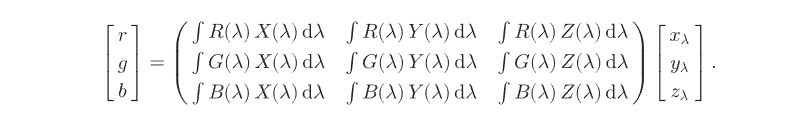

# Ray tracer

Basic ray tracer. Currently supports:

- Phong lighting model
- Specular-specular reflections
- Point lights

# Plan:
- Need to add equivalent for SampledSpectrum (for BxDF) and SampledWavelength (for color)
- Need to add color, note this from Color/RGB 
- Need to add BxDF
- add notes as needed

# To-do list:
- [ ] Add spatial hashing to objects (if I decide to support large enough scenes)
- [ ] Run it on gpu
- [ ] Make it real-time
